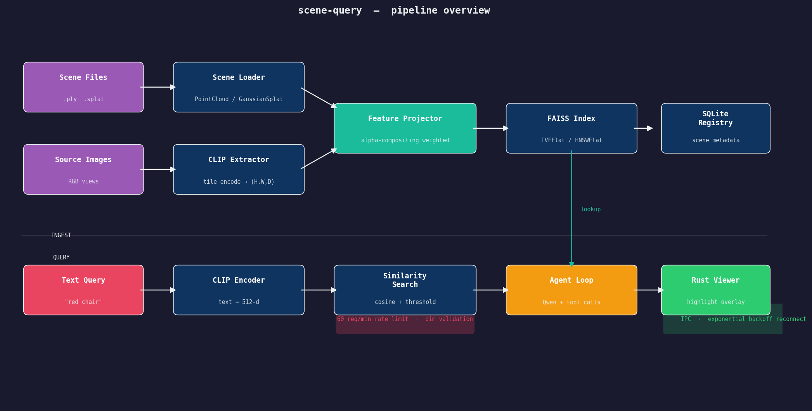
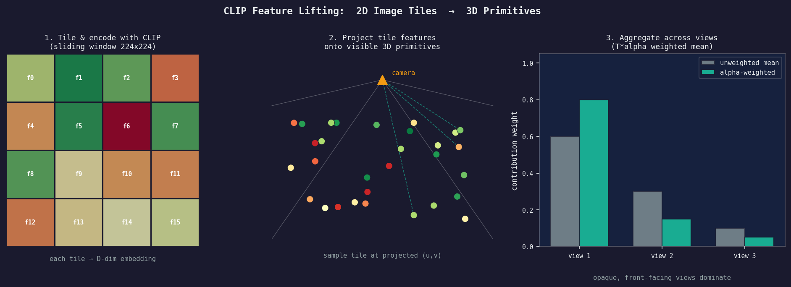
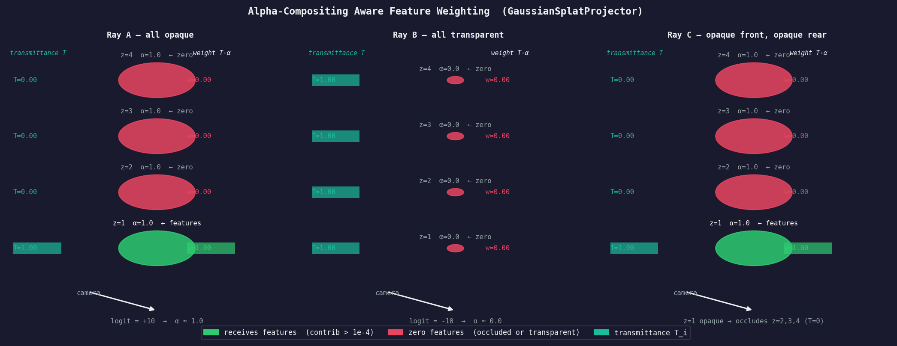
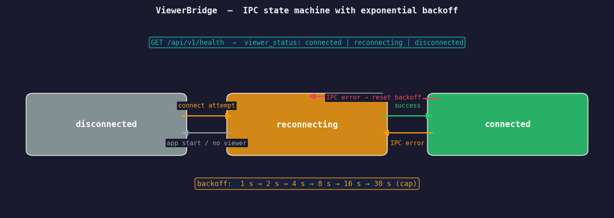

# scene-query

> Natural language queries over 3D scenes — Gaussian Splats, Point Clouds, NeRFs

Type plain English. Get spatially highlighted results in an interactive 3D viewer.

```
"where is the red chair?" → highlighted region in 3D
"count all tables near the window" → agent reasons, counts, replies
```

---

## Pipeline



The full stack: scene files are loaded and CLIP features are lifted from source images onto 3D primitives, stored in a FAISS index, and persisted to SQLite. Text queries are CLIP-encoded and compared by cosine similarity; an optional agent loop (Qwen via Ollama) handles multi-step reasoning with tool calls. Results are sent to a Rust-based 3D viewer over a Unix socket.

---

## Feature Lifting



Source images are divided into overlapping 224×224 tiles and each tile is encoded by CLIP into a D-dimensional embedding (512 for ViT-B/32, 768 for ViT-L/14). Each 3D primitive is projected into every camera's image plane; the tile at the projected pixel is sampled and accumulated across views.

For Gaussian Splats, contributions are **alpha-compositing weighted** — see below.

---

## Alpha Compositing for Gaussian Splats



Standard feature lifting treats every visible primitive equally. For Gaussian Splats this is wrong: a transparent Gaussian floating in front of an opaque surface should not "steal" the feature from the surface behind it.

`GaussianSplatProjector` sorts visible Gaussians front-to-back **per feature tile**, then applies the standard alpha compositing transmittance formula:

```
weight_i = T_i * alpha_i      T_i = prod_{j<i} (1 - alpha_j)
```

Primitives below `weight < 1e-4` (fully transparent or occluded) receive no features. Features are accumulated as a weighted sum, then L2-normalised.

---

## IPC & Viewer Status



The Python API talks to the Rust viewer over a Unix socket. If the viewer is not running (or restarts), `ViewerBridge` automatically reconnects with exponential backoff (1 s → 2 s → … → 30 s cap). The three-state status is exposed on every health check response.

---

## Quick Start

```bash
# Docker (recommended)
docker compose -f docker/docker-compose.yml up

# Local
uv sync --extra dev
uv run uvicorn python.api.app:app --reload
```

---

## API

### Ingest a scene

```bash
curl -X POST http://localhost:8000/api/v1/ingest \
  -H "Content-Type: application/json" \
  -d '{
    "scene_path": "/data/scenes/garden.ply",
    "scene_type": "point_cloud",
    "image_dir":  "/data/images/garden/"
  }'
# → { "scene_id": "uuid", "primitive_count": 120000, "feature_dim": 512, "status": "ok" }
```

### Query

```bash
curl -X POST http://localhost:8000/api/v1/query \
  -H "Content-Type: application/json" \
  -d '{"scene_id": "<id>", "query": "red chair", "top_k": 100, "threshold": 0.25}'
# → { "matches": [{"primitive_id": 42, "score": 0.87, "position_3d": [x, y, z]}, ...] }
```

Rate-limited to **60 requests / minute / IP** (configurable via `SQ_QUERY_RATE_LIMIT`).  
The server validates that the query embedding dimension matches the stored index — a mismatch returns HTTP 500 with a `re-ingest` hint.

### Agent (multi-turn, multi-step reasoning)

```bash
# Start a conversation
curl -X POST http://localhost:8000/api/v1/agent/chat \
  -H "Content-Type: application/json" \
  -d '{"message": "Count all chairs in scene room1 and highlight the ones near the window"}'
# → { "reply": "Found 4 chairs. 2 are near the window — highlighted.", "session_id": "..." }

# Follow up in the same session
curl -X POST http://localhost:8000/api/v1/agent/chat \
  -H "Content-Type: application/json" \
  -d '{"message": "How far apart are the two closest ones?", "session_id": "<id>"}'
```

The agent has access to `query_scene`, `count_matches`, `highlight_primitives`, and `measure_distance` tools. It runs locally via Ollama (Qwen).

### Scene management

```bash
# Metadata
curl http://localhost:8000/api/v1/scene/<id>

# Feature store stats
curl http://localhost:8000/api/v1/scene/<id>/features

# Delete
curl -X DELETE http://localhost:8000/api/v1/scene/<id>

# Health
curl http://localhost:8000/api/v1/health
# → { "status": "ok", "models_loaded": [...], "viewer_status": "connected" }
```

---

## Supported Formats

| Format   | Type            | Status  |
|----------|-----------------|---------|
| `.ply`   | Point Cloud     | ✓ |
| `.ply`   | Gaussian Splat  | ✓ |
| `.splat` | Gaussian Splat  | ✓ |
| `.obj`   | Mesh            | Planned |
| NeRF     | NeRF            | Planned |

---

## Configuration

All settings are environment variables with the `SQ_` prefix.

| Variable              | Default                        | Description                              |
|-----------------------|--------------------------------|------------------------------------------|
| `SQ_SCENE_ROOT`       | `data/scenes`                  | Allowed root for scene file paths        |
| `SQ_INDEX_ROOT`       | `data/indexes`                 | Where FAISS indexes are persisted        |
| `SQ_DB_URL`           | `sqlite:///data/scene-query.db`| Scene registry database (SQLite URL)     |
| `SQ_QUERY_RATE_LIMIT` | `60`                           | Max query requests per minute per IP     |
| `SQ_SOCKET_PATH`      | `/tmp/scene-query-viewer.sock` | Unix socket path for viewer IPC          |
| `SQ_LOG_LEVEL`        | `INFO`                         | Log level (`DEBUG`, `INFO`, `WARNING`)   |
| `SQ_MAX_FILE_SIZE_GB` | `5.0`                          | Maximum scene file size                  |

---

## Tech Stack

| Layer          | Technology                                 |
|----------------|--------------------------------------------|
| ML pipeline    | Python 3.11, CLIP (OpenCLIP), SAM, GroundingDINO |
| Feature store  | FAISS (FlatIP / IVFFlat / HNSWFlat)        |
| Scene registry | SQLite via aiosqlite                        |
| Agent          | Qwen via Ollama (local, tool-calling)       |
| API            | FastAPI + SlowAPI rate limiter              |
| 3D viewer      | Rust, threecrate                            |
| IPC            | MessagePack over Unix domain socket         |

---

## Interactive Demo (AI2-THOR)

Try natural language queries against a simulated living room scene — no 3D scene files needed. The demo uses [AI2-THOR](https://ai2thor.allenai.org/) as a physics-simulated environment, encodes all visible objects with CLIP, and lets you type free-form queries in the terminal while a live window highlights the best-matching objects.

### Install

```bash
uv sync --extra demo
```

This adds `ai2thor` and `opencv-python-headless` on top of the core dependencies. AI2-THOR downloads its Unity binary automatically on first run (~775 MB, one-time).

### Run

```bash
python scripts/ai2thor_demo.py --interactive
```

Default scene is `FloorPlan201` (living room). To try a different room:

```bash
python scripts/ai2thor_demo.py --interactive --scene FloorPlan1      # kitchen
python scripts/ai2thor_demo.py --interactive --scene FloorPlan301    # bedroom
python scripts/ai2thor_demo.py --interactive --scene FloorPlan401    # bathroom
```

### What happens

1. **Indexing** (~30 s) — the agent walks through the scene, crops every visible object, and encodes each with CLIP ViT-B/32. You'll see the scene scanning in the background.
2. **Live window opens** — the current room view is displayed.
3. **Type any query** in the terminal and press Enter. The window immediately highlights every object of the best-matching type in neon yellow.

### Controls

| Key | Action |
|-----|--------|
| `W` / `S` | Move forward / back |
| `A` / `D` | Rotate left / right |
| `Q` / `E` | Look up / down |
| `Esc` | Quit |

> **Note:** Click the cv2 window once after it opens so that keypresses are captured there rather than the terminal.

### Example queries

```
sofa or couch
television or screen
floor lamp
book or magazine
laptop
```

Queries are plain English — CLIP handles the semantic matching. Results update instantly after indexing because the comparison is just a dot product against pre-computed embeddings.

---

## Development

```bash
uv sync --extra dev
pre-commit install

# Tests
uv run pytest tests/unit/ -v
uv run pytest tests/integration/ -v -m "not e2e"

# Lint + types
uv run ruff check python/ tests/
uv run mypy python/

# Rust
cargo test
cargo clippy -- -D warnings

# Regenerate README diagrams
uv run --with matplotlib python scripts/generate_readme_assets.py

# Migrate existing on-disk indexes to the SQLite registry
uv run python scripts/migrate_registry.py
```

Branch from `dev`, PR back to `dev`. `dev` → `main` on release.

---

## License

MIT
